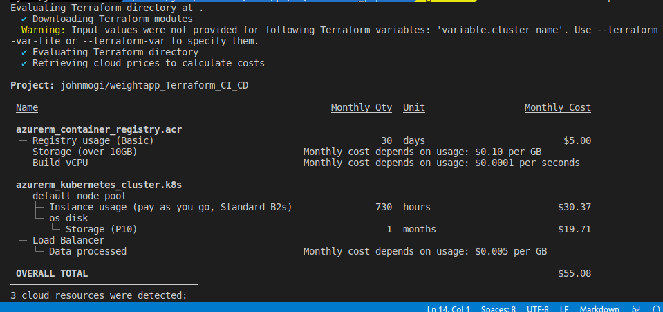

# CI CD using azure Devops - building the Terraform infrastructure

Hello and wellcome for this project, for a full video describing many of the processes involved:
https://youtu.be/Vuwd725U5bU

by approving the change the whole project will be rebuilt, this means the second repository will stop working unless manual connections are provided,
therefore do not approve of the incoming change in the CI or the next part of the project will be disconnected:

 

the project consists of many parts, we can divide those for sections:

## section I - the setup
in which we supply our connection parameters to both azure cloud using our portal subscription. 
proceeding into further connecting this subscripion into azure Devops (this connection setup might take a bit of time) 

## section II - the CI CD
using Azure devops we send any change in our working enviroment directly into the staging and production enviroments 
that reside inside two namespaces in a kubernetes cluster

this repository is the starting point in Sela's week 12 bootcamp. 
in this repository we control the infrastructure as code for the actual assets on the azure cloud. 
if you have a clue on how to use the terraform in order to build the cloud  
you can skip the following section directly to WORKING instructions for the terraform CI CD.. 

if not - follow the following:

## Stage 1 - create the AKS in Azure cloud.
you'll need to setup the following services: 
1. a Terraform Backend - manually create a new storage account and populate the backend.tf file (not included)"
redundency - LRS } performance standard
regarding backend - read more here on hiw to manage it securely:
https://www.terraform.io/language/settings/backends/configuration
<pre>
terraform init \
    -backend-config="address=demo.consul.io" \
    -backend-config="path=example_app/terraform_state" \
    -backend-config="scheme=https"
</pre>

2. now at that storage create a container, create a public as you can then go to shared access tokens and fill the key info on file-
terraform {
backend "azurerm" {
resource_group_name = "group-name"
storage_account_name = "accountname"
container_name = "datestorage"
key = "keyname"
access_key = "hlongstringaccessname"
}
}
3. for local dev, you can supply your subscription_id + tenant_id into the providers file
provider "azurerm" {
  features {}
  subscription_id = ""
  # client_id       = ""
  # client_secret   = ""
  tenant_id       = ""
}
, can be found here (use CLI az login - it would hand you out the info)

<pre>
terraform init \
    -backend-config="subscription_id=d" \
    -backend-config="tenant_id=" \
</pre>

1. create a new Kubernetes cluster in Azure cloud
2. Azure Container Registry (ACR).
3. Azure Managed PostgreSQL Service.

__Create a "FILE_NAME.tfvars" file:__

        pg_user          = "Postgres SQL user name" 
        pg_database      = "Postgres SQL database name" 
        pg_password      = "Postgres SQL password" 
        cluster_name     = "AKS cluster name" 
        acr_name         = "ACR name" 
        rg_name          = "Resource group name" 
        env              = "Environment name"

To deploy the infrastructure follow these steps:
1. Clone the repository.
2. Run: 
<pre>
        $ cd <repo name> terraform init // + backend config.
      </pre>
3. Run:

 tf plan -var-file="staging.tfvars" -out=planfile
 tf destroy -var-file="staging.tfvars" -auto-approve
        $ terraform apply -var-file="FILE_NAME.tfvars" -auto-approve
        
Follow these steps before creating the pipeline:
1. Follow this [link](https://kubernetes.io/docs/tasks/tools/) to install `kubectl' on your agent. 
1. Follow this [link](https://docs.microsoft.com/en-us/cli/azure/install-azure-cli-linux?pivots=apt) to install Azure CLI on LINUX. 
1. Follow this [link](https://docs.microsoft.com/en-us/cli/azure/authenticate-azure-cli) to login to Azure CLI. 
1. Run the following command to get access credentials for a managed Kubernetes cluster.

## WORKING instructions for the terraform CI CD
in addition we are using infracost to calculate any price change. 

by commiting and approving the process in azure devops the build stage will begin. 
also - please supply your backend details at the library variable group - Terraform 

to manually view price of current plan
## install infracost:

- then run - infracost breakdown --path .

- infracost breakdown --path . --format json --out-file infracost-base.json
+ suggest changes in the infrastructure (add resources etc.)

- infracost diff --path . --compare-to infracost-base.json

you will see the price change.

## SETUP phase for the 2nd CI CD : Azure DevOps + AKS kubectl connection
<pre>
        az login
        az account show
        az aks get-credentials --name k8sweight --resource-group weightapp
         kubectl config view --minify 
         server: https://weightdns-26ca6af0.hcp.eastus.azmk8s.io:443

         manuallly create a new namespace
         k create namespace weightapp
         kubectl config set-context --current --namespace=weightapp

kubectl get secret default -n weightapp -o json

kubectl get serviceAccounts k8sweight -n default -o=jsonpath={.secrets[*].name}
kubectl get serviceAccounts default -n default -o=jsonpath={.secrets[*].name}

</pre>
Create an environment and connect it with AKS cluster that created with Terraform.

# weightapp_Terraform_CI_CD

@ if using your own azure devops- the terraform extenstion:
https://marketplace.visualstudio.com/items?itemName=ms-devlabs.custom-terraform-tasks

## Requirements

| Name | Version |
|------|---------|
|  [terraform](#requirement\_terraform) | >= 0.14.9 |
|  [azurerm](#requirement\_azurerm) | =3.0.0 |

## Providers

| Name | Version |
|------|---------|
|  [azurerm](#provider\_azurerm) | 3.0.0 |

## Modules

No modules.

## Resources

| Name | Type |
|------|------|
| [azurerm_container_registry.acr](https://registry.terraform.io/providers/hashicorp/azurerm/3.0.0/docs/resources/container_registry) | resource |
| [azurerm_kubernetes_cluster.k8s](https://registry.terraform.io/providers/hashicorp/azurerm/3.0.0/docs/resources/kubernetes_cluster) | resource |
| [azurerm_resource_group.k8s](https://registry.terraform.io/providers/hashicorp/azurerm/3.0.0/docs/resources/resource_group) | resource |

## Inputs

| Name | Description | Type | Default | Required |
|------|-------------|------|---------|:--------:|
|  [TF\_VAR\_enviroment](#input\_TF\_VAR\_enviroment) | n/a | `string` | `"staging"` | no |
|  [acr\_name](#input\_acr\_name) | Registry name | `string` | `"weightappacr"` | no |
|  [agent\_count](#input\_agent\_count) | agent\_count | `number` | `1` | no |
|  [cluster\_name](#input\_cluster\_name) | Cluster name | `string` | n/a | yes |
|  [dns\_prefix](#input\_dns\_prefix) | dns\_prefix | `string` | `"weightdns"` | no |
|  [env](#input\_env) | Environment name | `string` | `"dev"` | no |
|  [enviroment](#input\_enviroment) | Environment name | `string` | `"staging"` | no |
|  [location](#input\_location) | n/a | `string` | `"eastus"` | no |
|  [rg\_name](#input\_rg\_name) | Resource group name | `string` | `"weightapp"` | no |

## Outputs

No outputs.